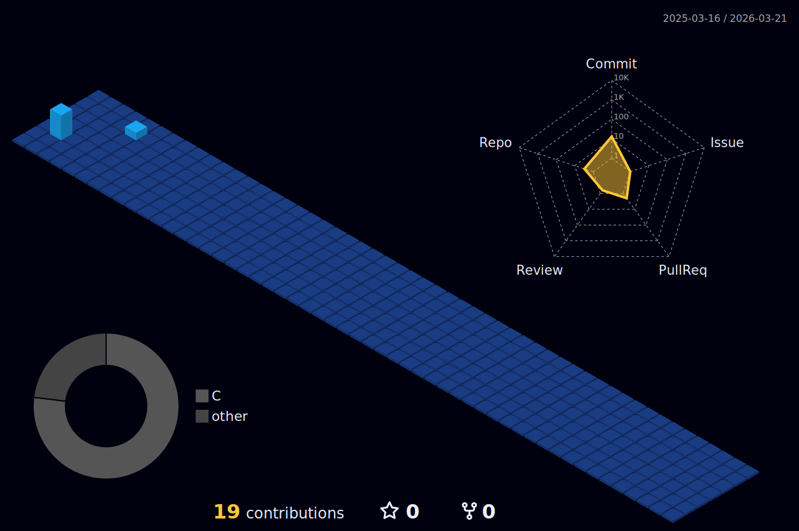

  

# 💫 About Me:
🔭 I’m MEPhI student, C, C++, Python developer and DevOps engineer 🌱 I deeply study the features of operating systems, especially Linux, current technologies, applications and frameworks related to my specialty  ⚡ I really like playing piano and drums!

## 🌐 Socials:

  

 

 

# 💻 Tech Stack:
                        

  

  
  

# 📊 GitHub Stats:
 
 

## 🏆 GitHub Trophies

### ✍️ Random Dev Quote

---

<!-- Proudly created with GPRM ( https://gprm.itsvg.in ) -->
